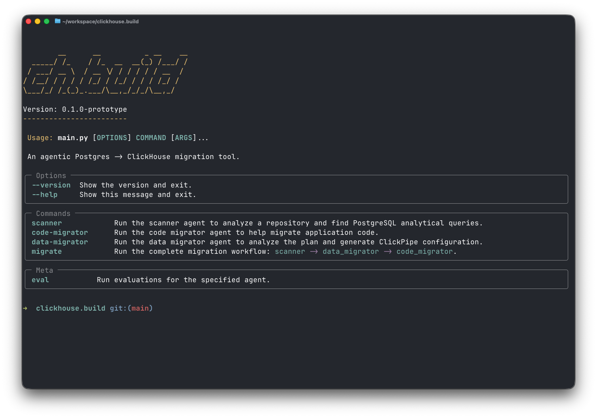

# ClickHouse Build (ProtoType)

Agentic PostgreSQL to ClickHouse migration tool.



## What Does It Do?

`clickhouse.build` automates the complex process of migrating from PostgreSQL to ClickHouse:

1. **Scans** your codebase to discover PostgreSQL analytical queries (aggregations, GROUP BY, window functions, etc.)
2. **Generates** ClickPipe configuration for CDC or snapshot-based data replication
3. **Migrates** application code by installing ClickHouse client libraries and implementing strategy patterns for query routing
4. **Supports** multiple ORMs: Prisma, Drizzle, and raw SQL

The tool uses specialized AI agents that understand your code structure, database schema, and ORM patterns to generate production-ready migration code.

## Prerequisites

Before using `clickhouse.build`, ensure you have:

- **Python 3.13+** (uses latest Python features)
- **uv** package manager ([installation guide](https://github.com/astral-sh/uv))
- **AWS credentials** with access to Amazon Bedrock
- **Claude Sonnet 4.5** enabled in your AWS Bedrock account
- A **Git repository** with PostgreSQL-based application code
- **Working branch** for migration changes

## Installation

1. Clone the repository:

```bash
git clone https://github.com/ClickHouse/clickhouse.build.git
cd clickhouse.build
```

2. Set up AWS credentials:

```bash
cp .env.template .env
# Edit .env with your AWS credentials
```

Required environment variables:
- `AWS_ACCESS_KEY_ID` - Your AWS access key
- `AWS_SECRET_ACCESS_KEY` - Your AWS secret key
- `AWS_DEFAULT_REGION` - AWS region (e.g., us-east-1)
- `LANGFUSE_SECRET_KEY` - (Optional) For observability
- `LANGFUSE_PUBLIC_KEY` - (Optional) For observability
- `LANGFUSE_HOST` - (Optional) Langfuse host URL

3. Install dependencies:

```bash
uv sync
```

## Preparation

Before running the migration:

1. **Work on a branch** - Never run migrations directly on main
2. **Create AGENTS.md** - Add an [AGENTS.md](https://agents.md/) file to your repository to help `chbuild` improve its efficacy when understanding your codebase

### AGENTS.md Example

Create an `AGENTS.md` file in your repository root to provide context about your application.
For more information see: https://agents.md/

# Agent Context

## Architecture
This is a Node.js expense tracking application using PostgreSQL.

## Database
- ORM: Prisma
- Database: PostgreSQL 14
- Key tables: users, expenses, categories, budgets

## Analytical Queries
We use PostgreSQL for both OLTP and OLAP workloads. The main analytical queries are:
- Monthly expense aggregations by category
- Budget tracking with rolling windows
- User spending analytics

## Migration Goals
- Move analytical queries to ClickHouse for better performance
- Keep transactional operations in PostgreSQL
- Maintain backward compatibility during transition
```

## Running

Display help and available commands:

```bash
uv run main.py --help
```

### Quick Start: Full Migration


Run the complete migration workflow (recommended for first-time users):

```bash
uv run main.py migrate /path/to/your/repo --replication-mode cdc
```

This will:
1. Scan for analytical queries
2. Generate ClickPipe configuration
3. Migrate application code
4. Prompt for approval before making any changes

### Individual Commands

**Scanner Agent** - Analyze a repository and find PostgreSQL analytical queries:

```bash
uv run main.py scanner [REPO_PATH]
```

Output: `.chbuild/scanner/scan_TIMESTAMP.json` with discovered queries

**Data Migrator Agent** - Generate ClickPipe configuration for data migration:

```bash
uv run main.py data-migrator [REPO_PATH] [--replication-mode cdc|snapshot|cdc_only]
```

Output: curl command with ClickPipe JSON configuration

**Code Migrator Agent** - Migrate application code:

```bash
uv run main.py code-migrator [REPO_PATH]
```

Output: Modified application files with ClickHouse integration

**Migrate** - Run the complete migration workflow (scanner → data-migrator → code-migrator):

```bash
uv run main.py migrate [REPO_PATH] [--replication-mode cdc|snapshot|cdc_only]
```

### Options

- `--skip-credentials-check` - Skip AWS credentials validation
- `--yes` / `-y` - Skip all confirmation prompts and approve all changes automatically (useful for CI/CD)
- `--replication-mode` - Set replication mode for data migration:
  - `cdc` - Change Data Capture with initial snapshot + real-time sync
  - `snapshot` - One-time snapshot replication only
  - `cdc_only` - CDC without initial snapshot

## Contributing

See [CONTRIBUTING.md](CONTRIBUTING.md) for development setup and guidelines.

## Support

- **Issues**: [GitHub Issues](https://github.com/ClickHouse/clickhouse.build/issues)
- **Discussions**: [GitHub Discussions](https://github.com/ClickHouse/clickhouse.build/discussions)
